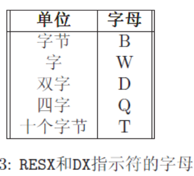
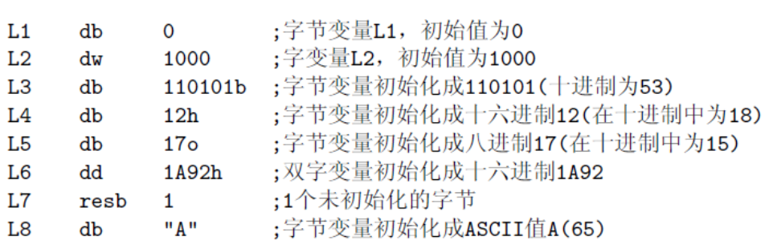

[TOC]

# 汇编(Assembly Language)

# 核心

1. 寻址
2. 操作数

# 计算机基本知识

### 内存

内存就是你想的那个内存，计算机从内存中读写当前程序

### 寄存器

寄存器是集成在CPU中的超高速存储器件，CPU可以

### Buffer和Cache(缓冲和缓存)

Buffer和Cache本质上解决的都是读写速度不匹配的问题，最直观的区别在于cache是随机读写，buffer是顺序读写。从IO速率快的到慢的叫buffer, 反之叫cache.

计算机的数据传输体系是这样的：

硬盘 --> 内存 --> CPU寄存器, IO速率从慢到快，以下举出几个场景来说明buffer和cache的必要性:

1. CPU频繁短间隔请求向硬盘写入数据
   - 此时如果没有buffer，硬盘将频繁地响应请求，而硬盘的随机读写性能远弱于顺序读写性能，

# 8086寄存器

### 通用寄存器

四个16位通用寄存器：**AX，BX，CX，DX**。

通用寄存器的意思就是啥都能干

通用寄存器具有以下特性：

1. 每个16位寄存器都能分解位两个8位寄存器来使用，例如AX可以分解成AH和AL寄存器(高低位)
2. 通用寄存器多用于数据移动和算术指令中

### 指针寄存器

两个16位指针寄存器:**SI, DI**

指针寄存器通常当作指针来使用，也可以作为通用用途，但指针寄存器不能分解为两个8位寄存器

### 基址寄存器和堆栈指针寄存器

16位BP和SP

### 段寄存器

16位**CS, DS, SS, ES**

段寄存器指出程序不同部分所使用的内存

1. CS代表代码段
2. DS代表数据段
3. SS代表堆栈段
4. ES代表附加段
5. ES当作一个暂时段寄存器来使用

### 指令指针寄存器

指令指针寄存器：**IP**

指令指针寄存器(IP) 与CS寄存器一起使用来跟踪CPU下一条执行指令的地址。通常，当一条指令执行时，IP提前指向内存里的下一条指令。

### FLAGS寄存器

FLAGS寄存器储存了前面指令执行结果的重要信息。这些结果在寄存器里以单个的位储存。例如：如果前面指令执行结果是0，Z位为1，反之为0。

# 段地址(selector)和偏移地址(offset)

intel通过利用两个16位寄存器来确定一个地址，开始的16位称为段地址，第二个16位称为偏移地址。

实际的物理地址 = 16*selector + offset

某一个字节在内存中的段地址不唯一，例如：

物理地址04808可以表示为：047C:0048，047D:0038，047E:0028 或047B:0058。

# 汇编语言(语法)

一条汇编指令的通常格式为：

mnemonic(指令助记符)	operands(操作数)

通常每个指令有固定数量的操作符(0到3个)

### 基本指令助记符

1. mov指令

   ```assembly
   mov <dest>, <src>   ;将src(源操作数)的数据拷贝到dest(目的操作数)
   ```

2. equ

   equ指示符可以用来定义一个符号。符号被命名为可以在汇编程序里使用的常量。(变量重命名)

   ```assembly
   symbol equ value
   ```

3. %define

   这个指示符和C中的#define非常相似。它通常用来定义一个宏常量，像在C里面一样。

   ```assembly
   %define SIZE 100
            mov     eax, SIZE
   ```

4. 数据指示符

   数据指示符使用在数据段中用来定义内存空间。保留内存有两种方法。第一种方法仅仅为数据定义空间；第二种方法在定义数据空间的同时给与一个初始值。第一种方法使用RESX指示符中的一个。X可由字母替代，字母由需要储存的对象的大小来决定。

   

   第二种方法(同时定义一个初始值)使用DX指示符中的一个。X可以由字母替代，字母的值与RESX里的值一样。使用变量来标记内存位置是非常普遍的。变量使得在代码中指向内存位置变得容易。下面是几个例子：

   

   

   


### 指令操作数

操作数可以有下面几种类型

1. 寄存器
   - 这些操作数直接指向CPU寄存器里的内容。
2. 内存
   - 这些操作数指向内存里的数据。数据的地址可能是硬编码到指令里的常量或可能直接使用寄存器的值计算得到。距离段的起始地址的偏移值即为此地址。
3. 立即数
   - 这些操作数是指令本身列出的固定的值。**它们储存在指令本身(在代码段)**，而不在数据段。
4. 暗指的操作数
   - 这些操作数没有明确显示。例如：往寄存器或内存增加1的加法指令。1是暗指的。
